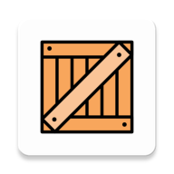
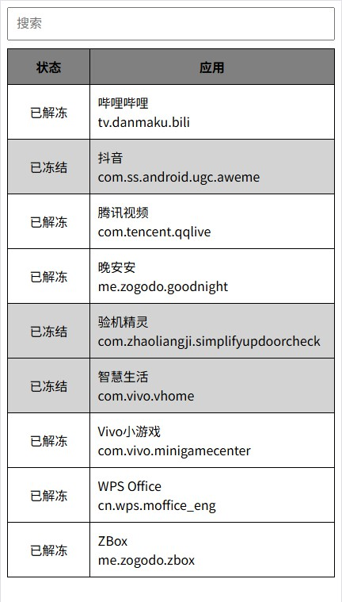

# zBox

免 root 禁用/启用 app, 禁止 app 自启, 节省电量.

# App截图





# 使用方法

## 使用前注意事项

1. 如果你的手机已经 root, 因为风险未知, 不建议使用 zBox
2. 确保你的手机 Android 版本大于等于 7.0
3. 确保你已经知道如何操作 `adb` 命令
4. 请阅读完此教程全部内容再开始操作
5. 使用前务必先备份好手机上的数据, 包括但不限于: 照片, 视频, 下载的文件, 微信QQ聊天记录, 二步验证秘钥
6. 因使用 zBox 造成的任何损失, 由使用者自行负责

## 方法1 设置 zBox 为设备管理员

### 什么是设备管理员？

设备管理员是 Android 企业框架下的一个功能，提供了免 root 禁用/启用任意 app 的能力.

一台手机只能设置一个管理员.

### 设置步骤

1. 安装 zBox
2. 打开手机的【开发者选项】并打开【USB调试】
3. 打开手机设置 - 帐户, 删除 **所有帐户**, 包括你的 Google/华为/小米等系统帐号（之后可以再登录回来）
4. 如果你之前设置了 应用双开, 多用户, 访客模式 等, 也需要全部关闭或删除（之后可以再打开）
6. 在电脑上执行 `adb shell dpm set-device-owner me.zogodo.zbox/.DeviceAdminReceiver`


如果看到类似如下输出, 说明设置成功了. 可以开始使用 zBox了. 此时可以把之前删除的帐号加回来了

```
Success: Device owner set to package me.zogodo.zbox/.DeviceAdminReceiver
Active admin set to component me.zogodo.zbox/.DeviceAdminReceiver
```


## 常见问题：

- 问：提示 `Not allowed to ... already several accounts on the device`

  答：第 3 步 账户没删干净. 可以使用 `adb shell dumpsys account` 查看仍存在的账户. 如果在 手机设置 - 账户 中没有看到命令列出的账户, 则需要使用 `adb shell pm disable-user --user 0 com.example.app` 命令先禁用对应的app, 设置成功后再使用 `pm adb shell enable com.example.app` 启用回来

- 问：提示 `Not allowed to ... already several users on the device`

  答：第 4 步 应用双开, 多用户或访客模式没删干净, 请确保关闭所有应用双开/访客模式/多用户. 可以使用 `adb shell pm list users` 命令查看所有用户, 使用 `adb shell pm remove-user $ID` 删除对应用户, 注意 user 0 不能删除!

- 问：提示 `Trying to set the device owner, but device owner is already set.`

  答：手机已经设置了其他 app 为设备管理员, 如: 冰箱/炼妖壶/小黑屋等. 一台手机上只能有一个设备管理员

- 问：MIUI 用户提示 `Neither user xxx nor current process has android.permission.MANAGE_DEVICE_ADMINS`

  答：MIUI 用户请关闭【MIUI 优化】


## 设置成功后注意事项

- 如果不想用 zBox 了, 请先启用所有已禁用的 app 再卸载 zBox, 否则将 **再也无法找回已禁用的app**


## 其他事项

- 小米手机可能需要关闭【MIUI 优化】

- 索尼手机需要拔 SIM 卡重启

- adb 工具可以在下列地址下载：

  Google 官方地址 （[Win](https://dl.google.com/android/repository/platform-tools-latest-windows.zip) [Mac](https://dl.google.com/android/repository/platform-tools-latest-darwin.zip) [Linux](https://dl.google.com/android/repository/platform-tools-latest-linux.zip)）


## 方法2（恢复出厂设置）

手机回复出厂设置, 恢复后不登录任何账户, 所有设置均选择跳过,

打开开发者选项, 打开USB调试,

然后执行以下命令:

```sh
adb shell dpm set-device-owner me.zogodo.zbox/.DeviceAdminReceiver

#看到如下提示才算成功
Success: Device owner set to package me.zogodo.zbox/.DeviceAdminReceiver
Active admin set to component me.zogodo.zbox/.DeviceAdminReceiver
```


# 其它命令

```sh
#查看已存在的用户
adb shell pm list users

#删除用户
adb shell pm remove-user $ID

#移除设备管理员(移除后需要恢复出厂设置才能再设置其他管理员)
adb shell dpm remove-active-admin me.zogodo.zbox/.DeviceAdminReceiver

# 禁用应用
pm disable-user --user 0 com.example.app

# 启用应用
pm enable com.example.app

adb shell pm disable-user --user 0 com.tencent.qqlive

```


# 已支持设备

- [x] 一加 3T
- [x] vivo X27
- [x] vivo Pad Air

