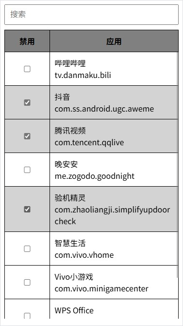

# zBox

启用设备管理员后, 可以冻结应用, 禁止应用自启, 节省电量.

## App截图



## 使用方法

手机回复出厂设置, 恢复后不登录任何账户, 所有设置均选择跳过,

打开开发者选项, 打开USB调试,

然后执行以下命令:

```sh
adb shell dpm set-device-owner me.zogodo.zbox/.DeviceAdminReceiver

#看到如下提示才算成功
Success: Device owner set to package me.zogodo.zbox/.DeviceAdminReceiver
Active admin set to component me.zogodo.zbox/.DeviceAdminReceiver
```

## 其它命令

```sh
#查看已存在的用户
adb shell pm list users

#删除用户
adb shell pm remove-user $ID

#移除设备管理员(移除后需要恢复出厂设置才能再设置其他管理员)
adb shell dpm remove-active-admin me.zogodo.zbox/.DeviceAdminReceiver
```


